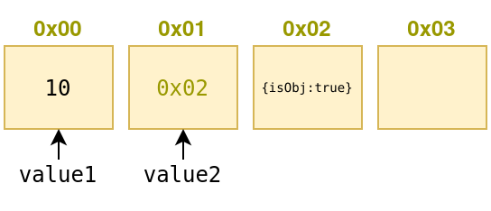
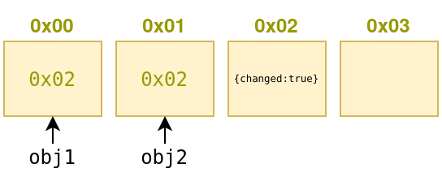

# Chapter 2 - Object Basics

An object is a collection of properties. A property is the mapping between a key and a value.

```js
const obj = {
	"abc": 100
}
```

In the above example, we have an object called `obj`. It has a property with the key `“abc”` and the value `100`.

The specific syntax we used to create the above object makes it an *object literal.* Object literals are defined using curly braces (`{}`) that enclose properties. The properties are defined using the colon (`:`), which separates the key and value. Object literals are not the only way to create objects. More on that later [^object-creation].

### Property key types

A property key can only be of type String or Symbol. It is possible to *define* a property using a key that is not one of those types, but this will internally convert the key to a string. Below, we define a property key with the number `100`. When we retrieve the keys for the object, the type of our key has changed to String, giving us `“100”`.

```js
const obj = { 100: true }
console.log(Object.keys(obj)) // [ "100" ]
```

JavaScript internally recognized that `100` isn't a string or symbol, so it converted it to a string before making the assignment[^key-conversion]. This behavior can also be seen with other types.

```js
const obj = { [true]: "", [undefined]: "", [null]: "", [{}]: "" }
console.log(Object.keys(obj)) // [ "true", "undefined", "null", "[object Object]" ]
```

The same possible conversion that happens when you define a property can also happen when you retrieve a property value.

```js
const obj = { [true]: "a", 100: "b" }

console.log(obj["true"]) // a
console.log(obj["100"]) // b
```

>💡 This behavior becomes very clear with arrays. Arrays are objects like object literals, meaning their keys are strings. Array object keys are usually referred to as *indexes*.
>```js
>const arr = ["a", "b", "c"]
>console.log(Object.keys(arr)) // [ "0", "1", "2" ]
>```
>

### Symbol property keys

As mentioned before, symbols are also valid object keys. This means that they don’t get converted into strings when used as property keys. 

```js
const key1 = "Key 1";
const key2 = Symbol("Key 2");

const obj = {
 [key1]: "Value 1",
 [key2]: "Value 2"
}

console.log(obj[key1]) // Value 1
console.log(obj[key2]) // Value 2
```

An advantage of using symbols as keys is that they are guaranteed to be unique. This is useful if you want to prevent properties from being overridden by code consuming your objects. Also, symbols aren’t returned by the conventional methods used to retrieve property keys like `Object.keys` and `Object.getOwnPropertyNames`.

```js
const obj = { [Symbol("Key 1")]: true, "Key 2": true }

console.log(Object.keys(obj)) // [ "Key 2" ]
console.log(Object.getOwnPropertyNames(obj)) // [ "Key 2" ]
```

If you really want to retrieve symbol property keys you can use `Object.getOwnPropertySymbols` or `Reflect.ownKeys`. The first returns only symbol keys and the second returns all property keys regardless of their type.

```js
const obj = { [Symbol("Key 1")]: true, "Key 2": true }

console.log(Object.getOwnPropertySymbols(obj)) // [ Symbol(Key 1) ]

console.log(Reflect.ownKeys(obj)) // [ Symbol(Key 1), "Key 2" ]
```

### Well-known Symbols

Some symbols are considered special to the internals of JavaScript. They are known as the *Well-known Symbols*[^well-known-symbols]. Using them to define property keys can alter internal functionality. You can read more about them in [Appendix A](./appendix-a.md).

### Property value types

If property keys are restricted to only strings and symbols, how are property values restricted? The answer is that they aren’t. Values of properties can be of any type, even other objects.

```js
const obj = {
  key1: "Value 1",
  key2: 200,
  key3: 300n,
  key4: true,
  key5: null,
  key6: undefined,
  key7: Symbol(),
  key8: { isObject: true }
}
```

### Primitives vs object values/references

Primitives and objects behave differently when assigned to variables or passed to functions. When you assign a primitive to a variable, the value is stored directly in the memory address associated with that variable. When you assign an object to a variable, a *reference* to the object is stored instead. 

```js
const value1 = 10
const value2 = { isObj: true }
```

Below is an illustration of the above code. It shows `value1` directly storing `10` and `value2` storing a reference (`0x02`) to the `{isObj:true}` object.



When copying primitive values into other variables, a simple copy is made of the value. When copying objects, you instead copy the reference. This means multiple variables can reference the same object value. 

```js
let obj1 = { changed: false }
let obj2 = obj1

obj2.changed = true

console.log(obj1) // { changed: true }
console.log(obj2) // { changed: true }
```

Above, we create an object with a reference assigned to the variable `obj1`. We then copy the reference into the variable `obj2`. When then change a property on the object that `obj2` references. This is, of course, the same object that `obj1` references. They effectively share an object.



Note, that there is a difference between changing an object and assigning a brand new object to a variable. Below, we re-assign the variable `obj2` to a new object literal. The result is that the variables reference two separate objects.

```js
let obj1 = { changed: false }
let obj2 = obj1

obj2 = { changed: true } // <-- New Object!

console.log(obj1) // { changed: false }
console.log(obj2) // { changed: true }
```

> ⚠️ The above illustrations of memory are greatly simplified. The mental model they provide still holds though.
> 

#### Function parameters

An assignment similar to that of variables happens to function parameters. Consider this example:

```js
function func(param) { /* ... */ }

const myValue = 10

func(myValue)
```

Here we have a function called `func` and a variable called `myValue`, which holds a primitive value (`10`). We call the function and pass in `myValue` as a parameter. Interestingly, the value of `myValue` is not passed directly. Instead, a copy is made, which is assigned to `param`. This means we can safely assume that functions won’t modify our primitive variables.

```js
function iCantChangeYourPrimitive(val) {
	val = 200
}

const myVal = 100
iCantChangeYourPrimitive(myVal)
console.log(myVal) // 100
```

The same safety cannot be assumed for objects passed to functions. We have to remember that we are assigning a *reference* to the parameter. This means that the function doesn’t get a copy of the object, it gets a copy of the reference.

```js
function iCanChangeYourObject(obj) {
  obj.changed = true
}

const myObj = {}
iCanChangeYourObject(myObj)
console.log(myObj) // { changed: true }
```

#### Object assigned to other object's property

What happens to objects when you assign them to other objects as properties? The answer is that the object *reference* becomes the property value. This is the same functionality we have with variable and function parameter assignment.

```js
const obj1 = { changeMe: "" }
const obj2 = { obj1Here: obj1 }

obj1.changeMe = "I changed!"

console.log(obj2.obj1Here) // { changeMe: "I changed!" }
```

This can, in some rare cases, lead to a circular object structure where two objects both reference *each other*. This becomes a problem if you want to convert the objects to a format like JSON, which doesn’t support references.

```js
const obj1 = {}
const obj2 = {}

obj1.otherObj = obj2
obj2.otherObj = obj1

// TypeError: Converting circular structure to JSON
console.log(JSON.stringify(obj1))
```

<hr/>

Next chapter: [Chapter 3 - Property Descriptors and Object Restrictions ➡️](./chapter-3.md)

[^object-creation]: Another way is using the `Object` constructor. This is mentioned in a note in [Chapter 7](./chapter-7.md#putting-this-and-prototype-together-creating-methods)
[^key-conversion]: https://tc39.es/ecma262/#sec-topropertykey
[^well-known-symbols]: https://tc39.es/ecma262/#sec-well-known-symbols